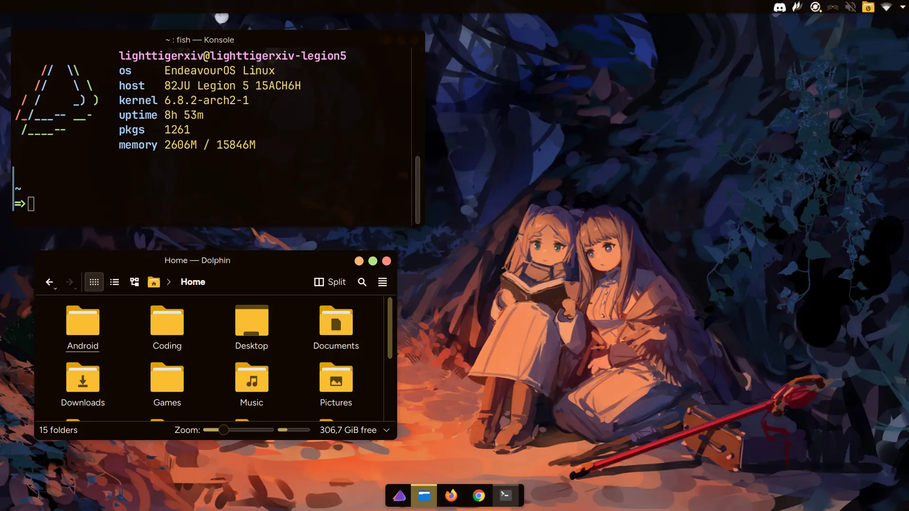
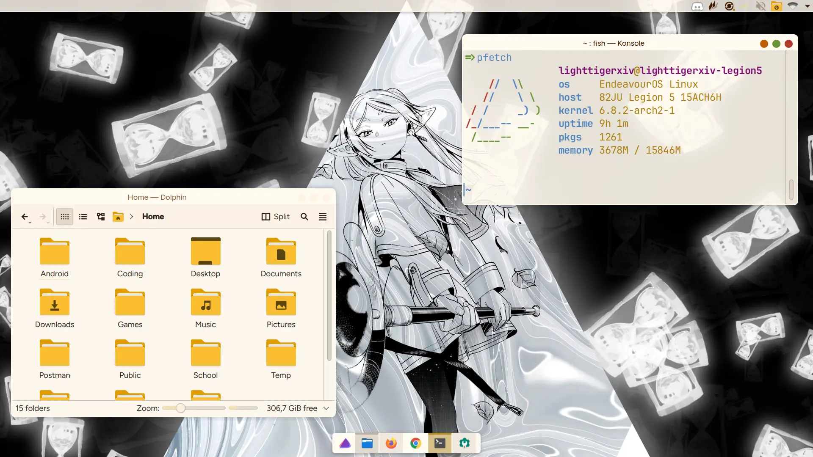

<div align="center">


### Whiskers for [KDE](https://kde.org/)

<div>
    
    
</div>
</div>

## 👷‍♂️ Install

- Run the following commands
```bash
git clone https://github.com/Whiskers-Color-Scheme/kde;
cd kde;
chmod +x install.sh;
./install.sh;
```

- Go to kde settings
- Open the colors settings, select the theme and apply
- Open the window decorations settings, select the window decoration and apply

## 💻 Maintainers

- [lighttigerXIV](https://github.com/lighttigerxiv)